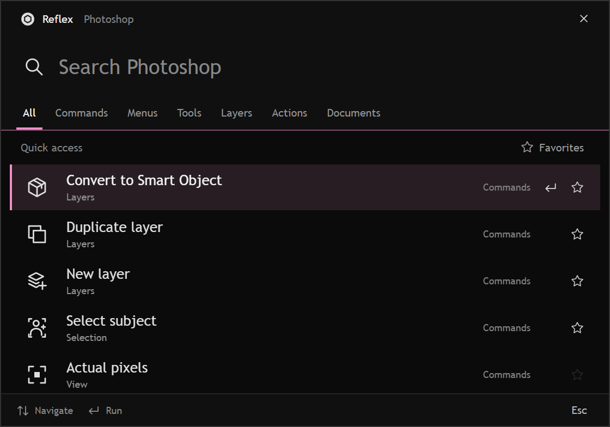

<p align="center"><picture><source media="(prefers-color-scheme: dark)" srcset="assets/reflex.svg"></picture></p>

<h1 align="center">Reflex</h1>

<p align="center">Search Photoshop. Hold a shortcut. Run your next command.</p>

<p align="center"><a href="https://github.com/SynkitNET/Reflex/releases">Downloads</a> · <a href="docs/usage.md">How to use</a> · <a href="CONTRIBUTING.md">Contribute</a></p>



Reflex adds a floating search palette and a customizable wheel to Photoshop.
Find commands, menus, tools, layers, open documents, and your loaded actions.
Keep frequently used commands on a four- or eight-direction wheel: hold your
shortcut, aim, and release.

Built by **[Synkit](https://synkit.net/)**. Open source under the [MIT license](LICENSE).

## What it does

- Search across Photoshop commands, menus, tools, layers, documents, and actions.
- Create named wheels and assign commands to four or eight directions.
- Bind search and the wheel to keyboard shortcuts or supported mouse buttons.
- Choose solid accent colors, including Pink, adjust their coverage, and tint icons.
- Keep favorites and frequently used commands close at hand.
- Drop a single Missing ping from a wheel slot, just because.

The panel and native wheel ship together in one `.ccx`. No companion app or
account is needed. Shortcuts are active only while Photoshop is active.

## Download and install

**0.6.7 is a Windows development pre-release.** Requires Photoshop **26.0 or
newer** and Creative Cloud Desktop. A clean installation on a separate machine
still needs verification.

1. Open [Releases](https://github.com/SynkitNET/Reflex/releases) and download
   `Reflex-0.6.7-win-x64-dev.ccx` from the release assets.
2. Close Photoshop. If you used a development copy, unload it in UXP Developer
   Tools; stop the old Reflex companion if you previously installed it.
3. Open the `.ccx` and follow the Creative Cloud installation prompts.
4. Open Photoshop, then **Plugins → Reflex → Reflex**.
5. Open **Shortcuts** and confirm the status says **Ready**.

The GitHub **Source code** ZIP is for development; install the `.ccx` to use
Reflex. See [Adobe's installation guide](https://developer.adobe.com/uxp/guides/how-to/distribution/install/)
if Creative Cloud does not open the package.

| Platform | Availability |
| --- | --- |
| Windows x64 | Development CCX; native build and automated checks pass |
| macOS Apple Silicon | Source included; not yet built or tested |
| macOS Intel | Source included; not yet built or tested |

There is no Mac download yet. [Mac build and validation details](docs/macos.md).
The image above is an interface preview with sample data.

## Quick start

| Action | Default shortcut |
| --- | --- |
| Open search | Ctrl + Alt + K |
| Open the wheel | Hold Ctrl + Alt + W, aim, release |
| Cancel | Escape, or return to the wheel center |

Use **Shortcuts** to record your own bindings. Use **Wheels** to choose a slot
and assign a command, tool, menu item, or loaded Photoshop action. **Open wheel**
also lets you click a sector to run it.

The default wheel contains New layer, Levels, Delete, Missing ping, Invert
colors, Invert selection, Fill, and Hue / Saturation. Delete removes selected
layers; Fill uses the foreground color.

[More on search, wheel behavior, customization, and limitations](docs/usage.md).

## Known limitations

- **Remove is disabled** after a reported Photoshop crash when selected through
  Reflex. It remains searchable with an explanation.
- Command availability depends on the current document, layer, selection, and
  Photoshop version. Not every command is valid in every context.
- Mac builds and clean-install testing remain outstanding. See the
  [release checklist](docs/release-checklist.md).

## Development

Use Node.js 22 or newer:

```sh
npm ci
npm test
npm run check
npm run preview
```

The browser preview uses sample data. Building the Photoshop plugin also
requires C++ tools, CMake, and a separately obtained Adobe UXP Hybrid Plugin SDK.
See [Contributing](CONTRIBUTING.md) and [native build instructions](native/README.md).

The repository includes Windows and macOS native source, tests, asset generators,
and packaging tools. Compiled addons and the Adobe SDK are not in Git history.

## License

Reflex source and artwork are [MIT licensed](LICENSE). Adobe components and
other dependencies retain their own terms; see [third-party notices](THIRD_PARTY_NOTICES.md).
Photoshop is required and is not included.
